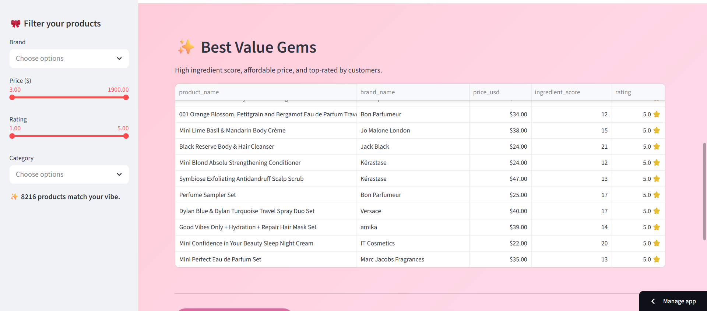
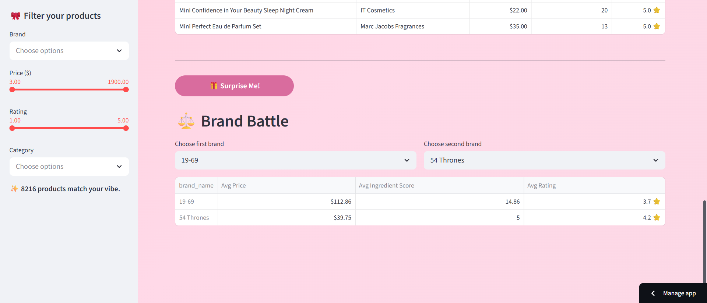
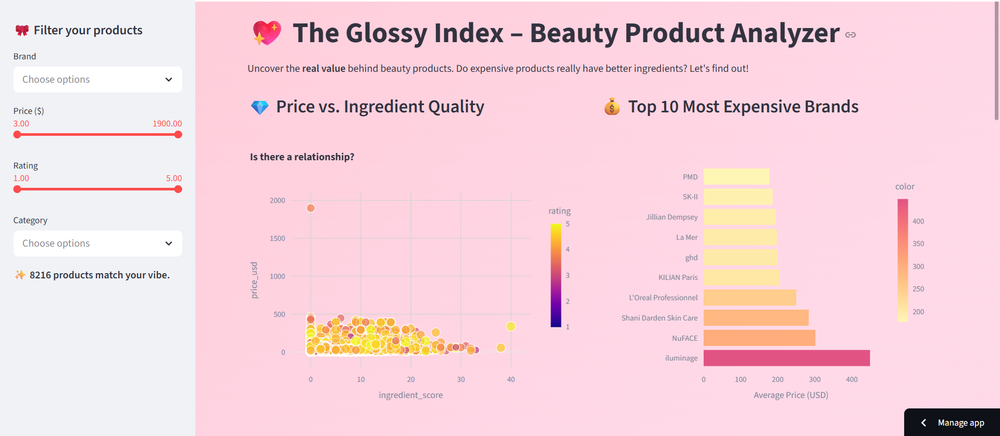
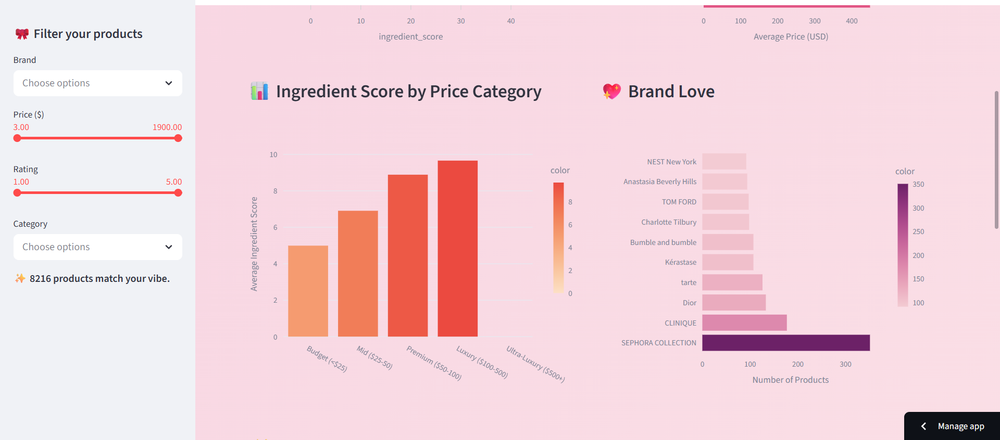

# 💄 Glossy Index – Beauty Product Value Analyzer

An interactive dashboard that uncovers the real value behind beauty products. Explore whether expensive products actually have better ingredients, discover top‑rated affordable gems, and compare brands side by side. Built with Python and Streamlit.

## Live Demo
**[View the live dashboard here](https://glossyindex-gsbx2fp7jt64bcywsigchu.streamlit.app/)**  
(Click the link – it may take a few seconds to wake up)

##  About the Project
I’ve always wondered: *Is that luxury moisturiser worth the splurge, or am I just paying for pretty packaging?*  
This project answers that question by analysing a dataset of 8,000+ Sephora products, including:

- **Product names, brands, prices, customer ratings**
- **Full ingredient lists** for each product
- **Categories** (moisturiser, serum, perfume, etc.)

I built a custom ingredient‑scoring system (the “Glossy Index”) to quantify ingredient quality, then created an interactive dashboard so anyone can explore the relationship between price, ingredients, and customer love.

## Features
- **Multi‑filter sidebar** – filter by brand, price range, rating, and product category.
- **Price vs. Ingredient Quality scatter plot** – see at a glance if expensive = better (spoiler: it doesn’t!).
- **Top 10 most expensive brands** – a chic bar chart showing which brands command the highest prices.
- **Ingredient score by price category** – proves that budget products can compete on quality.
- **“Best Value Gems” table** – lists affordable products with high ingredient scores and perfect 5‑star ratings.
- **Brand comparison tool** – pick two brands and compare average price, ingredient score, and rating.
- **Surprise Me button** – randomly selects a gem from the list and celebrates with a burst of balloons! 🎈

## Built With
- **Python** – pandas, matplotlib, seaborn, plotly
- **Streamlit** – interactive web app framework
- **GitHub** – version control and deployment

##  Screenshots

##  Key Insights
- **Price does not equal quality** – expensive products don’t consistently have better ingredients; many budget brands score just as high.
- **Luxury brands top the price list** – La Mer, SK‑II, and others are the most expensive, but their ingredient scores vary widely.
- **Hidden gems exist** – dozens of products under $50 have ingredient scores >10 and perfect 5‑star ratings. (Check the table!)
- **Fragrance products** often contain many common ingredients (limonene, linalool, etc.), which contribute to higher scores but can also be irritants – the dashboard lets you explore this trade‑off.

##  How to Run Locally
1. Clone this repository  
   `git clone https://github.com/jzoe68159-png/glossy-index.git`
2. Install dependencies  
   `pip install -r requirements.txt`
3. Run the app  
   `streamlit run beauty_dashboard.py`

##  Repository Structure
- `beauty_dashboard.py` – main Streamlit app
- `product_info.csv` – dataset (Sephora product info)
- `requirements.txt` – Python packages
- `graph1&2_.png`, `graph3&4_.png`, `brand_battle.png` , `best_value_gems.png` – screenshots
- `README.md` – you're reading it!

## 👩‍💻 Author
**Zoe John**

Have questions? Feel free to reach out!

*Made with 💄, and a lot of curiosity*
